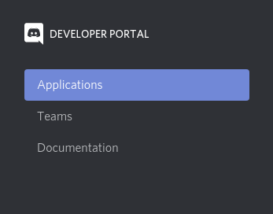
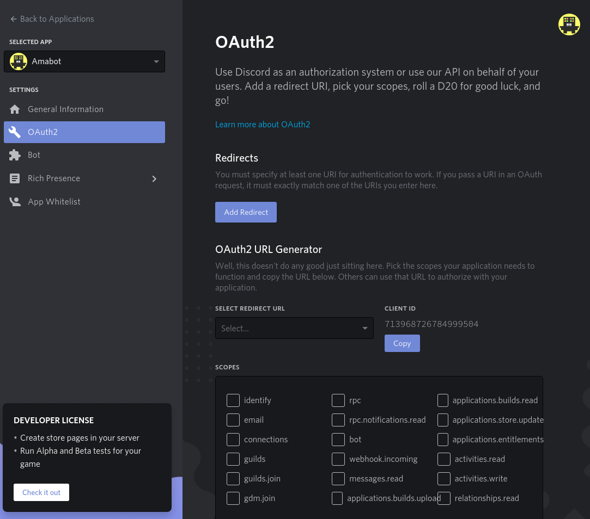

# Creando una aplicación
Para crear nuestro Bot de Discord, primero tenemos que crear una aplicación en el [*portal de desarrolladores*](https://discord.com/developers/applications), eso se puede hacer muy
fácilmente yendo a la sección de [applications](https://discord.com/developers/applications)

y presionando "New application"

A continuación introducimos el nombre que queremos para nuestra aplicación

Y listo!!! con esto tendremos creada nuestra aplicación de Discord.

# Creando nuestro bot
Una vez creada la aplicación debemos crear el Bot, para eso deberemos ir a la sección de "bot"

**Nota**: Debemos tomar en cuenta que no se puede borrar una vez creado y para borrarlo deberemos eliminar nuestra aplicación completa.

Con esto se ha creado un *usuario bot* que nos servirá para interactuar con la aplicación, a continuación deberemos guardar el *token* dando click en "copy", el token es muy importante ya que nos da acceso a el usuario bot que creamos, **siempre debes tener seguro tu token**, ya que el que lo tenga podrá también conectarse desde ese usuario

## Dándole permisos al bot
 
Ahora que tenemos nuestro bot creado deberemos añadirlo a un servidor, para eso necesitamos un link el cual podremos crear en la sección de *OAuth2*, que es el sistema de autorización que usa la app de discord

En la pestaña de *Oauth2* en la parte de "scope" deberemos seleccionar "bot"

Lo cual nos mostrará los siguientes permisos que le podemos otorgar a nuestro bot:

Debemos de tomar en consideración que los permisos son muy importantes ya que limitan lo que nuestro bot puede hacer, siempre debemos de asignar **los roles mínimos necesarios** para que nuestro bot funcione.

Los permisos de administrador son los que más acciones nos permiten hacer y es el que usaremos nosotros para experimentar con la API, pero a la hora de crear un Bot **debemos tomar en cuenta las acciones que nuestro bot realizará y los permisos que vamos a usar** y siempre tratar de asignar los mínimos necesarios.

Esto nos genera un link el cual nos va apermitir agregar el bot a un servidor con los permisos que le asignamos

Pegamos el link en el navegador y nos desplegará un cuadro donde podremos seleccionar el servidor de discord al que queremos agregar nuestro bot

Nos mostrará los permisos que solicita

Si todo sale bien veremos una pantalla de confirmación y tendremos nuestro bot en el servidor de Discord

