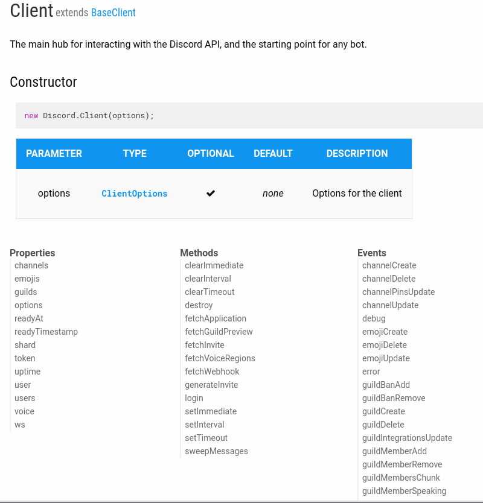
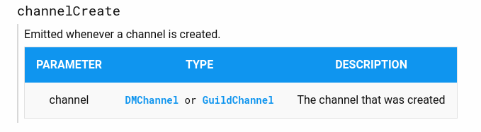
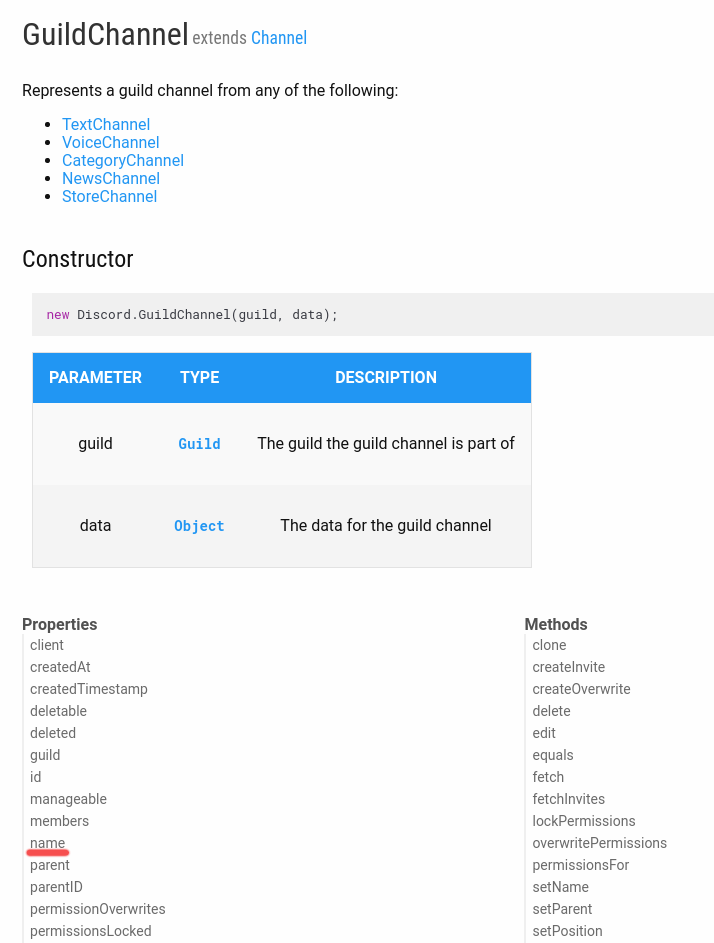
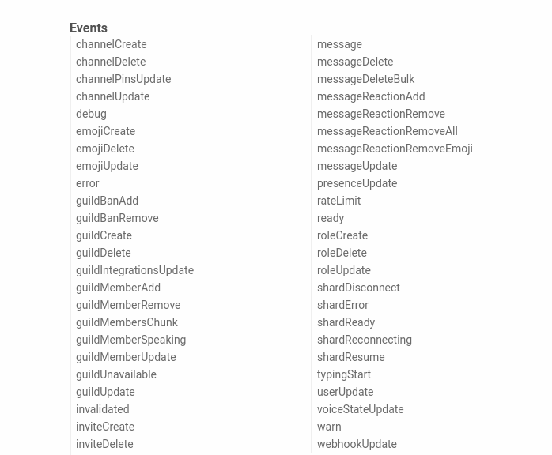

# Eventos

La mayoría de la programación interactiva se basa en eventos, en la sección anterior usamos dos eventos: el evento *ready* y el evento *message*;
Sin embargo éstos son sólo dos de varios que nos ofrece discord.js los cuales podemos ver en la documentación de la librería bajo la sección de la clase **Client** que es la clase que ocupamos para conectarnos a nuestro bot



## Listeners (escuchando eventos)
Para escuchar o esperar un evento usamos el método **on()** al que le pasamos el nombre del evento que queremos escuchar como primer parámetro, y la función que procesará el evento (*handler*) en el segundo parámetro.

Por ejemplo si queremos realizar una accion cuando se cree un nuevo canal, deberemos escuchar el evento "channelCreate" y pasarle la función que se encargará de manejar el evento de la siguiente manera:

```js
client.on('channelCreate', (channel)=>{
    console.log(`el canal ${channel.name} se ha creado`)
    })

```
Para poder trabajar con los eventos debemos ver qué elemento nos pasa cada evento, esto lo podemos descubrir en la documentación de  discord.js, al clickear el evento iremos a la sección que lo describe.


En este caso
el evento "channelCreate" nos pasa en el **callback** el canal que se creó (DMChannel o GuildChannel), DMChannel se refiere a un canal de mensajes privados, GuildChannel se refiere al canal de un servidor, ambas clases se basan de la clase *Channel*; Usaremos *GuildChannel* el cual según la documentación contiene el atributo *name*.



Así como usamos el evento "channelCreate" podemos usar todos los eventos de la clase **Client** simplemente mencionando el nombre del evento como primer parámetro del método **on()** y la función que queremos ejecutar como segundo parámetro, a continuación se listan todos los eventos de la clase Client, para más información consultar la [documentación oficial](https://discord.js.org/#/docs/main/stable/general/welcome).


